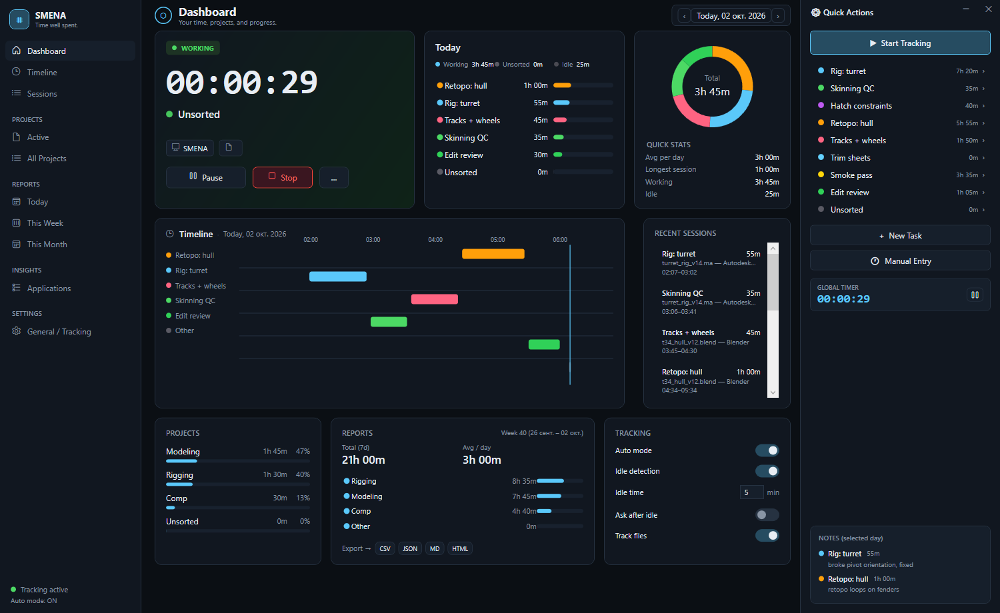
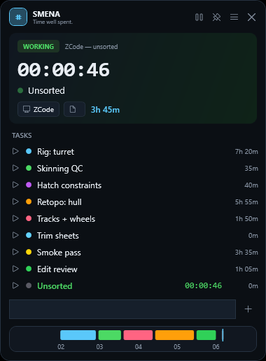

# SMENA



**Passive time tracker for Windows — your time is written down by itself.**

*Documentation in Russian: [README.ru.md](README.ru.md)*

SMENA is a local time tracker for people who forget to press "start". A background
poller watches the active window and writes work blocks on its own — there is
nothing to press, so there is nothing to forget. Tasks with keywords catch the
right windows automatically; a manual stopwatch is there when you want it.

Everything stays on your machine: no cloud, no accounts, no telemetry, no
screenshots. Data lives in `%APPDATA%\UCHET\` as plain JSON.

| | |
|---|---|
| | **Dashboard** — working-now card, today's donut and bars, per-task timeline, projects, week report |
|  | **Widget** — always-available mini timer: live clock, task rows with stopwatch, quick add, day strip. One `Ctrl+Alt+U` away |

## How it works

- **Passive capture** — a 5-second poller records the active window into blocks
  by itself. Manual timer is optional; while it runs, auto capture pauses
  (no double counting).
- **Tasks + keywords** — a task lists comma-separated keywords; the window title
  outranks the process name, the longest keyword wins. No match → the block lands
  in **Unsorted**, nothing is lost.
- **Idle detection** — after N minutes without input the block is closed at the
  last real activity. An optional prompt offers to log the gap when you return.
- **Assignment tools** — click a block to assign it, merge all Unsorted into one
  task, split sessions, edit blocks after the fact, or reset Unsorted to zero.

## Features

- **Dashboard**: working-now card with app/file chips, today's stats, per-task
  gantt, recent sessions, week totals with CSV / JSON / Markdown / HTML export
- **Timeline**: day strip + activity log with multi-select, collapse and bulk assign
- **Sessions**: split, notes per block, edit date/time/task, delete
- **Reports**: week grid (tasks × days) with per-project grouping
- **Themes**: SMENA dark plus Blender / Maya / Houdini / Nuke / DaVinci / Unreal /
  Substance looks (Settings → Appearance)
- **Task colors**: pick an accent color per task — stats, timeline and the widget follow it
- **Widget**: compact always-available window with a live clock, task stopwatches,
  quick add and a day strip
- **Tray**: live status tooltip, pause/resume, manual timer, exit

## Download

Grab `SMENA_v*.zip` from [Releases](../../releases), unzip, run `SMENA.exe`.
The build is self-contained — Windows 10/11 x64, no runtime installation needed.

## Build from source

Requires the .NET 8 SDK (Windows, WPF):

```
dotnet build UCHET.sln
dotnet test  UCHET.sln
dotnet run --project UCHET_CS
```

## Hotkeys

| Keys | Action |
|---|---|
| `Ctrl+Alt+S` | start / stop the manual stopwatch (last or first task) |
| `Ctrl+Alt+P` | pause / resume tracking |
| `Ctrl+Alt+U` | show / hide the widget |

## License

[MIT](LICENSE.txt) © Maksim Kovalev
